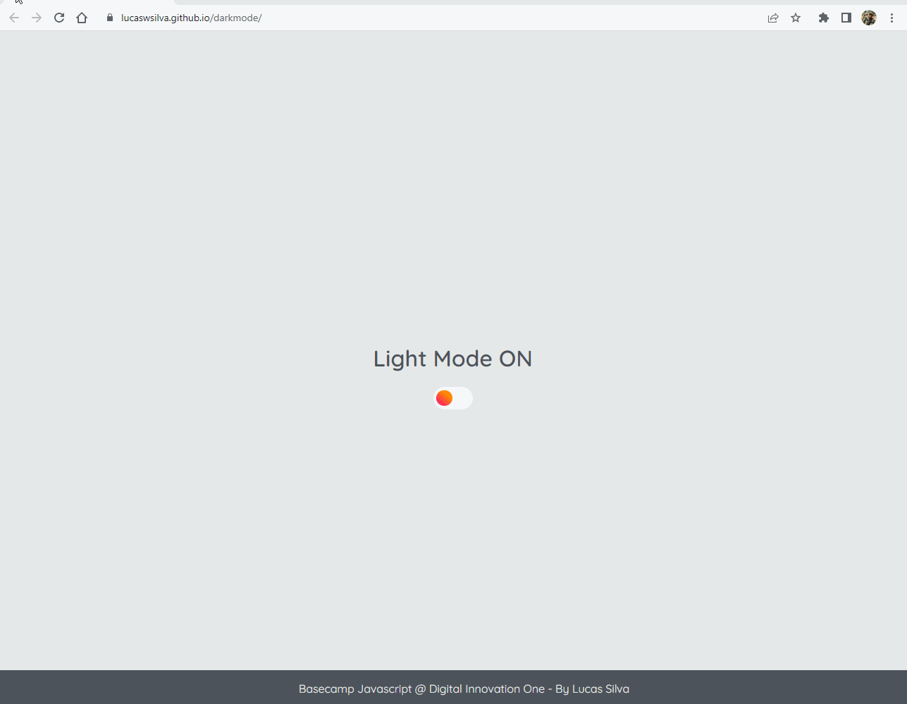

# Light Mode / Dark Mode JavaScript
Este projeto consiste em um exemplo simples de como criar um botão de alternância de tema (light/dark mode) em uma página web utilizando HTML, CSS e JavaScript.

## Como utilizar
Ao abrir a página index.html, você verá uma página simples com um botão para alterar o tema. Ao clicar neste botão, o tema da página será alternado entre light e dark mode.

<h1 align="center">
  
</h1>

## 🛠 Tecnologias utilizadas

As seguintes ferramentas foram usadas na construção do projeto:
- 
- 
- 

### Github pages
https://lucaswsilva.github.io/darkmode/
